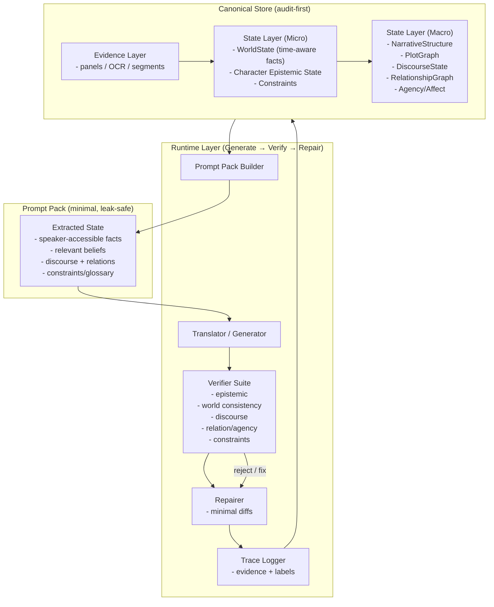

# Future Modeling Plan (Draft)

This document captures longer-horizon modeling ideas that are not implemented
in the current runtime. It is intentionally separate from near-term execution
and tooling improvements.

## Motivation

LLMs can track narrative intent and Theory of Mind (ToM) signals, but they are
fragile under long context, shifting viewpoints, and implicit knowledge. This
plan proposes making those signals explicit and machine-checkable to reduce
translation regressions in story-heavy data.

## Core Direction

1. Separate belief/state from preference/constraints so failure causes are
   debuggable and can be corrected independently.
2. Externalize world facts as time-indexed atomic propositions with validity
   intervals, plus events/relations to model changes across turns.
3. Track per-character observations, beliefs, and goals to prevent knowledge
   leakage and improve implicature handling.
4. Compile the pipeline against task metrics (e.g., DSPy) and add targeted evals
   for ToM-style consistency failures and long-context regressions.

## Proposed Modeling Layers (Minimum Viable Schema)

## v1.0 構造図（レイヤ＋ビュー＋実行ループ）

### 用語解説（図中コンポーネント）

- Evidence Layer: パネル、OCR テキスト、台詞セグメント、効果音などの
  生のマルチモーダル入力で、根拠参照として扱う。
- State Layer (Micro): 時間付き世界事実、人物の信念状態、制約の
  シーン単位ログ。監査可能性の基盤。
- State Layer (Macro): ナラティブ構造、因果プロット、ディスコース、
  関係、意図/感情を集約した長期サマリ。
- Canonical Store: 冗長でも監査可能性を優先した完全な状態保管庫。
- Prompt Pack: 単一生成ステップ向けに切り出す最小・リーク防止の状態。
- Prompt Pack Builder: リーク回避と安定入力のために必要な状態だけ抽出。
- Generator: Prompt Pack から翻訳候補を生成。
- Verifier Suite: 知識・世界整合・ディスコース・関係/意図・制約の検証群。
- Repairer: 検証で検知された問題に対して最小差分で修正。
- Trace Logger: 根拠ポインタ、ラベル、修正前後差分を記録。

### WorldState (time-indexed facts)

- facts[]: { factId, proposition, validFrom, validTo, confidence, evidenceSpan }
- events[]: { eventId, t, type, participants, status }
- entities[]: { id, type, canonicalName, aliases }
- relations[]: { a, b, type, validFrom, validTo, confidence }

### CharacterState[i] (belief graph + voice)

- observations[]: { t, source, content, certainty }
- beliefs[]: { about, value, confidence, derivedFrom, higherOrder }
- goals[]: { goal, urgency, confidence }
- voiceProfile: { register, snark, politeness, catchphrases, tabooWords }

### Constraints (preferences; not beliefs)

- glossary, styleGuide, rating, layout, publisherRules

## Validation Goals

1. Check world-state consistency across time (no invalid jumps).
2. Prevent perspective leakage (character says what they should not know).
3. Enforce discourse-level terminology consistency.
4. Tie failures to either state errors or constraint violations for actionable
   repairs.
